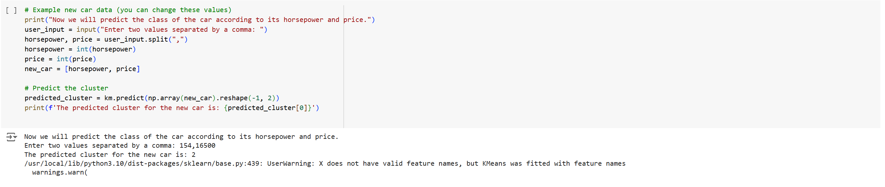

# Car-Price-and-Horsepower-Clustering-with-K-Means
# Introduction
This project involves clustering car data based on their price and horsepower using the K-Means clustering algorithm. The aim is to identify distinct groups (clusters) of cars that share similar characteristics in terms of price and horsepower.

# Project Overview
The project includes the following steps:

Data Collection: Gathering car data, including features like price and horsepower.
Data Preprocessing: Cleaning and preparing the data for clustering.
K-Means Clustering: Applying the K-Means algorithm to group the cars into clusters.
Analysis and Visualization: Analyzing and visualizing the resulting clusters to understand the underlying patterns in the data.

# Dataset
The dataset used in this project contains information about various cars, specifically focusing on their price and horsepower. This data is essential for training the K-Means model and deriving meaningful clusters.

# Key Sections in the Notebook
Data Exploration:
Load the dataset and display basic statistics.
Visualize the distribution of price and horsepower.
Data Preprocessing:
Handle missing values and outliers.
Normalize the data for better clustering performance.
K-Means Clustering:
Apply the K-Means algorithm with an optimal number of clusters.
Analyze the characteristics of each cluster.
Visualization:
Plot the clusters to visualize the separation based on price and horsepower.
Use various plots to interpret the results.
Prediction:
Predict the cluster for new car data based on user input (horsepower and price).

# Results
The project successfully identifies clusters of cars that share similar characteristics in terms of price and horsepower. These clusters can be useful for understanding market segments and making informed decisions in the automotive industry.

